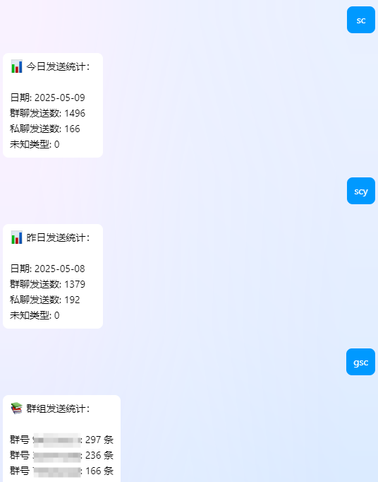
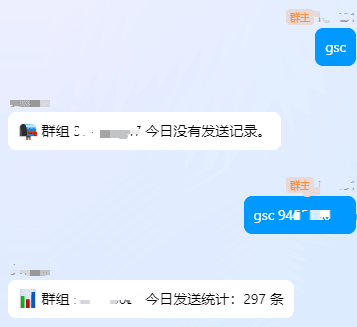

# nonebot-plugin-sendcount

一个用于统计 NoneBot 群聊与私聊发送消息数量的插件。支持每日记录、自动归档、群组分发统计、命令查看等功能。

## 🧩 安装

到src/plugins目录下git clone。

```bash
pip install nonebot-plugin-sendcount # 有空就上传
```

## 🚀 使用方式

需要SUPERUSER权限，使用`.env`下的`SUPERUSERS`配置项。
插件加载后自动生效，无需额外配置。支持以下指令：

### 基础指令

前缀使用Bot的总前缀

- `统计` 或 `sc`：查看今日消息统计
- `昨日统计` 或 `scy`：查看昨日消息统计

### 群组统计

- `群组统计` 或 `gsc`：查看今日所有群的消息数（私聊中使用`gsc all`显示所有群，群聊中默认仅显示当前群，管理员可查看本群）
- `昨日群组统计` 或 `gscy`：查看昨日所有群的消息数（同上）

支持加上群号参数查看特定群（SUPERUSER），如：

```text
gsc 123456789
```

## 📸 示例

### 今日消息统计


### 群组消息统计


## 📁 日志目录结构

所有统计文件位于：

```plaintext
data/msg_stats/YYYY-MM-DD/
├── stats.log          # 总览
├── group_stats.csv    # 群组消息数
├── group.log          # 群聊详细记录
├── private.log        # 私聊详细记录
```

## 🧠 实现特点

- 自动 Hook `call_api` 方法，统计所有发送消息行为
- 自动按日期分目录存储
- 重启后自动恢复数据

## 📄 License

MIT
